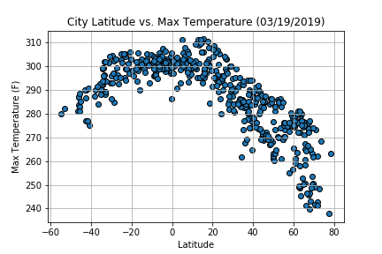
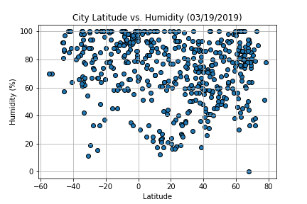
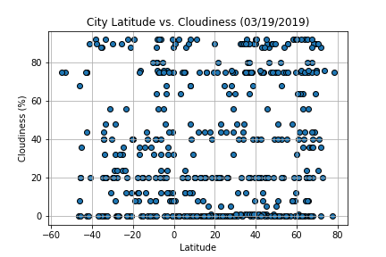
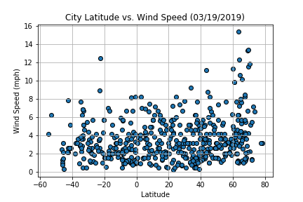

# WeatherPy
----

The objective of this project was to analyze the effect of latitude on the following weather variables: temperature, humidity, cloudiness, and wind speed. Select 500 cities using the Citypy Python library Github repository after ramdomly selecting latitudes and longitudes. After retrieving city names from Citypy, the code retrieves weather data for those locations from the Open Weather API. With this data, some scatter plots were generated using Matplotlib to analyze the correlation between latitude and the other weather variables.

### Analysis
* As expected, there's a correlation between latitude and temperature. The cities with lower latitudes have higher temperatures.
* There's no correlation between Latitude and Humidity, Cloudiness and Wind Speed.
* The ramdom sample has a bias toward cities in the Northern Hemisphere

---


```python
# Import Libraries
import matplotlib.pyplot as plt
import pandas as pd
import numpy as np
import requests
import time
import os
from pprint import pprint
from datetime import date

# Import API key
from api_keys import api_key

# Incorporated citipy to determine city based on latitude and longitude
from citipy import citipy

# Output File (CSV)
output_data_file = os.path.join("Output","cities.csv")

# Range of latitudes and longitudes
lat_range = (-90, 90)
lng_range = (-180, 180)
```


```python
# Verify library versions if some error occurs

#pd.__version__ # Pandas version: 0.23.4
#np.__version__ # Numpy version: 1.15.4
#import matplotlib as mat
#mat.__version__ # Matplotlib version: 3.0.2
```

## Generate Cities List


```python
# List for holding lat_lngs and cities
lat_lngs = []
cities = []

# Create a set of random lat and lng combinations
lats = np.random.uniform(low=-90.000, high=90.000, size=1500)
lngs = np.random.uniform(low=-180.000, high=180.000, size=1500)
lat_lngs = zip(lats, lngs)

# Identify nearest city for each lat, lng combination
for lat_lng in lat_lngs:
    city = citipy.nearest_city(lat_lng[0], lat_lng[1]).city_name
    
    # If the city is unique, then add it to a our cities list
    if city not in cities:
        cities.append(city)

# Print the city count to confirm sufficient count
len(cities)
```


    626


### Perform API Calls
* Perform a weather check on each city using a series of successive API calls.
* Include a print log of each city as it'sbeing processed (with the city number and city name).


```python
# Build partial query URL
url = "http://api.openweathermap.org/data/2.5/weather?"
query_url = f"{url}appid={api_key}&q="

# Set up lists to hold reponse info
name = []
cloud = []
country = []
dt =[]
humid = []
lat = []
lng = []
temp = []
wind = []

record = 1
group = 1

# Loop through the list of cities and perform a request for data on each
print("Beginning Data Retrieval")
print("-----------------------------")
for city in cities:
    print(f'Processing Record {record} of set {group} | {city}')
    try:
        response = requests.get(query_url + city).json()
        name.append(response['name'])
        cloud.append(response['clouds']['all'])
        country.append(response['sys']['country'])
        dt.append(response['dt'])
        humid.append(response['main']['humidity'])
        lat.append(response['coord']['lat'])
        lng.append(response['coord']['lon'])
        temp.append(response['main']['temp_max'])
        wind.append(response['wind']['speed'])
    except KeyError:
        print('City not found. Skipping...')
    except:
        print('An unexpected error has ocurred, Skipping...')
    # Wait 65 seconds after record #50
    # API allows just 60 requests per minute
    if record == 50:
        time.sleep(65)
        record = 1
        group += 1
    record += 1
    # Breaks the loop after it retrieves 500 cities
    if len(name) == 500:
        break
print("-----------------------------")
print("Data Retrieval Complete")
print("-----------------------------")
```

    Beginning Data Retrieval
    -----------------------------
    Processing Record 1 of set 1 | longonjo
    Processing Record 2 of set 1 | alyangula
    Processing Record 3 of set 1 | hithadhoo
    Processing Record 4 of set 1 | upernavik
    Processing Record 5 of set 1 | suarez
    Processing Record 6 of set 1 | tual
    Processing Record 7 of set 1 | tshikapa
    Processing Record 8 of set 1 | kui buri
    Processing Record 9 of set 1 | taolanaro
    City not found. Skipping...
    Processing Record 10 of set 1 | sao joao da barra
    Processing Record 11 of set 1 | abu dhabi
    Processing Record 12 of set 1 | dikson
    Processing Record 13 of set 1 | punta arenas
    Processing Record 14 of set 1 | atuona
    Processing Record 15 of set 1 | saskylakh
    Processing Record 16 of set 1 | airai
    Processing Record 17 of set 1 | tazovskiy
    Processing Record 18 of set 1 | florianopolis
    Processing Record 19 of set 1 | san pedro
    Processing Record 20 of set 1 | davila
    Processing Record 21 of set 1 | byron bay
    Processing Record 22 of set 1 | jamestown
    Processing Record 23 of set 1 | hobart
    Processing Record 24 of set 1 | pevek
    Processing Record 25 of set 1 | pierre
    Processing Record 26 of set 1 | port-gentil
    Processing Record 27 of set 1 | mataura
    Processing Record 28 of set 1 | lata
    Processing Record 29 of set 1 | chuy
    Processing Record 30 of set 1 | san carlos de bariloche
    Processing Record 31 of set 1 | kassala
    Processing Record 32 of set 1 | tabas
    Processing Record 33 of set 1 | namibe
    Processing Record 34 of set 1 | ostrovnoy
    Processing Record 35 of set 1 | nioro
    Processing Record 36 of set 1 | busselton
    Processing Record 37 of set 1 | sentyabrskiy
    City not found. Skipping...
    Processing Record 38 of set 1 | baruun-urt
    Processing Record 39 of set 1 | leningradskiy
    Processing Record 40 of set 1 | deqing
    Processing Record 41 of set 1 | souillac
    Processing Record 42 of set 1 | lashio
    Processing Record 43 of set 1 | port alfred
    Processing Record 44 of set 1 | attawapiskat
    City not found. Skipping...
    Processing Record 45 of set 1 | ushuaia
    Processing Record 46 of set 1 | lasa
    Processing Record 47 of set 1 | arraial do cabo
    Processing Record 48 of set 1 | kapenguria
    Processing Record 49 of set 1 | chokurdakh
    Processing Record 50 of set 1 | kununurra
    Processing Record 2 of set 2 | naze
    Processing Record 3 of set 2 | albany
    Processing Record 4 of set 2 | katobu
    Processing Record 5 of set 2 | vestmannaeyjar
    Processing Record 6 of set 2 | vaini
    Processing Record 7 of set 2 | saint-philippe
    Processing Record 8 of set 2 | lebu
    Processing Record 9 of set 2 | springbok
    Processing Record 10 of set 2 | eyl
    Processing Record 11 of set 2 | sorvag
    City not found. Skipping...
    Processing Record 12 of set 2 | lompoc
    Processing Record 13 of set 2 | nanortalik
    Processing Record 14 of set 2 | ponta do sol
    Processing Record 15 of set 2 | namatanai
    Processing Record 16 of set 2 | san fernando
    Processing Record 17 of set 2 | tsihombe
    City not found. Skipping...
    Processing Record 18 of set 2 | amderma
    City not found. Skipping...
    Processing Record 19 of set 2 | vuktyl
    Processing Record 20 of set 2 | victoria
    Processing Record 21 of set 2 | sassandra
    Processing Record 22 of set 2 | kapaa
    Processing Record 23 of set 2 | hambantota
    Processing Record 24 of set 2 | rikitea
    Processing Record 25 of set 2 | zhuhai
    Processing Record 26 of set 2 | saint george
    Processing Record 27 of set 2 | grand-santi
    Processing Record 28 of set 2 | bredasdorp
    Processing Record 29 of set 2 | hilo
    Processing Record 30 of set 2 | nikolskoye
    Processing Record 31 of set 2 | torbay
    Processing Record 32 of set 2 | mendoza
    Processing Record 33 of set 2 | lishu
    Processing Record 34 of set 2 | poshekhonye
    Processing Record 35 of set 2 | mehamn
    Processing Record 36 of set 2 | faanui
    Processing Record 37 of set 2 | barrow
    Processing Record 38 of set 2 | illoqqortoormiut
    City not found. Skipping...
    Processing Record 39 of set 2 | iqaluit
    Processing Record 40 of set 2 | rimouski
    Processing Record 41 of set 2 | rafaela
    Processing Record 42 of set 2 | bowen
    Processing Record 43 of set 2 | bluff
    Processing Record 44 of set 2 | kavaratti
    Processing Record 45 of set 2 | saldanha
    Processing Record 46 of set 2 | shaoguan
    Processing Record 47 of set 2 | chitral
    Processing Record 48 of set 2 | guerrero negro
    Processing Record 49 of set 2 | bathsheba
    Processing Record 50 of set 2 | dongsheng
    Processing Record 2 of set 3 | fortuna
    Processing Record 3 of set 3 | mount gambier
    Processing Record 4 of set 3 | cockburn town
    Processing Record 5 of set 3 | pacific grove
    Processing Record 6 of set 3 | hamilton
    Processing Record 7 of set 3 | vaasa
    Processing Record 8 of set 3 | pilar
    Processing Record 9 of set 3 | provideniya
    Processing Record 10 of set 3 | port elizabeth
    Processing Record 11 of set 3 | sao luiz gonzaga
    Processing Record 12 of set 3 | guanica
    Processing Record 13 of set 3 | halifax
    Processing Record 14 of set 3 | talcahuano
    Processing Record 15 of set 3 | belaya gora
    Processing Record 16 of set 3 | new norfolk
    Processing Record 17 of set 3 | kodiak
    Processing Record 18 of set 3 | beyneu
    Processing Record 19 of set 3 | moerai
    Processing Record 20 of set 3 | sur
    Processing Record 21 of set 3 | bethel
    Processing Record 22 of set 3 | mount darwin
    Processing Record 23 of set 3 | cape town
    Processing Record 24 of set 3 | tigil
    Processing Record 25 of set 3 | ugoofaaru
    Processing Record 26 of set 3 | aksu
    Processing Record 27 of set 3 | tashtyp
    Processing Record 28 of set 3 | new glasgow
    Processing Record 29 of set 3 | avarua
    Processing Record 30 of set 3 | bengkulu
    City not found. Skipping...
    Processing Record 31 of set 3 | batagay-alyta
    Processing Record 32 of set 3 | castro
    Processing Record 33 of set 3 | aykhal
    Processing Record 34 of set 3 | anahuac
    Processing Record 35 of set 3 | rungata
    City not found. Skipping...
    Processing Record 36 of set 3 | caravelas
    Processing Record 37 of set 3 | payo
    Processing Record 38 of set 3 | mahebourg
    Processing Record 39 of set 3 | palabuhanratu
    City not found. Skipping...
    Processing Record 40 of set 3 | campbell river
    Processing Record 41 of set 3 | ribeira grande
    Processing Record 42 of set 3 | plainfield
    Processing Record 43 of set 3 | margate
    Processing Record 44 of set 3 | belushya guba
    City not found. Skipping...
    Processing Record 45 of set 3 | villefontaine
    Processing Record 46 of set 3 | vallenar
    Processing Record 47 of set 3 | lavrentiya
    Processing Record 48 of set 3 | georgetown
    Processing Record 49 of set 3 | kozhva
    Processing Record 50 of set 3 | myskhako
    Processing Record 2 of set 4 | piripiri
    Processing Record 3 of set 4 | siparia
    Processing Record 4 of set 4 | marv dasht
    City not found. Skipping...
    Processing Record 5 of set 4 | thompson
    Processing Record 6 of set 4 | sijunjung
    Processing Record 7 of set 4 | ilulissat
    Processing Record 8 of set 4 | vila franca do campo
    Processing Record 9 of set 4 | bambous virieux
    Processing Record 10 of set 4 | beloha
    Processing Record 11 of set 4 | parana
    Processing Record 12 of set 4 | cidreira
    Processing Record 13 of set 4 | lorengau
    Processing Record 14 of set 4 | east london
    Processing Record 15 of set 4 | sheltozero
    Processing Record 16 of set 4 | road town
    Processing Record 17 of set 4 | puerto ayora
    Processing Record 18 of set 4 | severo-kurilsk
    Processing Record 19 of set 4 | mar del plata
    Processing Record 20 of set 4 | marawi
    Processing Record 21 of set 4 | centralia
    Processing Record 22 of set 4 | qaqortoq
    Processing Record 23 of set 4 | laguna de perlas
    Processing Record 24 of set 4 | owando
    Processing Record 25 of set 4 | alghero
    Processing Record 26 of set 4 | lagoa
    Processing Record 27 of set 4 | saint leonard
    Processing Record 28 of set 4 | hermanus
    Processing Record 29 of set 4 | sistranda
    Processing Record 30 of set 4 | san patricio
    Processing Record 31 of set 4 | pangody
    Processing Record 32 of set 4 | kaitangata
    Processing Record 33 of set 4 | muhos
    Processing Record 34 of set 4 | tuatapere
    Processing Record 35 of set 4 | khatanga
    Processing Record 36 of set 4 | novyy urengoy
    Processing Record 37 of set 4 | paamiut
    Processing Record 38 of set 4 | uttaradit
    Processing Record 39 of set 4 | jabiru
    City not found. Skipping...
    Processing Record 40 of set 4 | pacifica
    Processing Record 41 of set 4 | beringovskiy
    Processing Record 42 of set 4 | awjilah
    Processing Record 43 of set 4 | kavieng
    Processing Record 44 of set 4 | richards bay
    Processing Record 45 of set 4 | shache
    Processing Record 46 of set 4 | gorgan
    Processing Record 47 of set 4 | sao geraldo do araguaia
    Processing Record 48 of set 4 | taloqan
    Processing Record 49 of set 4 | karamea
    City not found. Skipping...
    Processing Record 50 of set 4 | kemptville
    Processing Record 2 of set 5 | mackay
    Processing Record 3 of set 5 | tiksi
    Processing Record 4 of set 5 | yulara
    Processing Record 5 of set 5 | poum
    Processing Record 6 of set 5 | norman wells
    Processing Record 7 of set 5 | dubrovnik
    Processing Record 8 of set 5 | longyearbyen
    Processing Record 9 of set 5 | katoro
    Processing Record 10 of set 5 | hovd
    Processing Record 11 of set 5 | karlskoga
    Processing Record 12 of set 5 | saleaula
    City not found. Skipping...
    Processing Record 13 of set 5 | cairns
    Processing Record 14 of set 5 | yellowknife
    Processing Record 15 of set 5 | pochutla
    Processing Record 16 of set 5 | novosheshminsk
    Processing Record 17 of set 5 | sept-iles
    Processing Record 18 of set 5 | marsa matruh
    Processing Record 19 of set 5 | sokolo
    Processing Record 20 of set 5 | meyungs
    City not found. Skipping...
    Processing Record 21 of set 5 | tuktoyaktuk
    Processing Record 22 of set 5 | qaanaaq
    Processing Record 23 of set 5 | tramore
    Processing Record 24 of set 5 | codrington
    Processing Record 25 of set 5 | narsaq
    Processing Record 26 of set 5 | luzhou
    Processing Record 27 of set 5 | urdzhar
    City not found. Skipping...
    Processing Record 28 of set 5 | nadvoitsy
    Processing Record 29 of set 5 | butaritari
    Processing Record 30 of set 5 | bollnas
    Processing Record 31 of set 5 | kerema
    Processing Record 32 of set 5 | talnakh
    Processing Record 33 of set 5 | asau
    City not found. Skipping...
    Processing Record 34 of set 5 | camacari
    Processing Record 35 of set 5 | tezu
    Processing Record 36 of set 5 | samusu
    City not found. Skipping...
    Processing Record 37 of set 5 | waterbury
    Processing Record 38 of set 5 | ampanihy
    Processing Record 39 of set 5 | ransang
    City not found. Skipping...
    Processing Record 40 of set 5 | safwah
    City not found. Skipping...
    Processing Record 41 of set 5 | aklavik
    Processing Record 42 of set 5 | sao gabriel da cachoeira
    Processing Record 43 of set 5 | sola
    Processing Record 44 of set 5 | maumere
    Processing Record 45 of set 5 | coahuayana
    Processing Record 46 of set 5 | husavik
    Processing Record 47 of set 5 | cayenne
    Processing Record 48 of set 5 | chitrakonda
    Processing Record 49 of set 5 | severnyy
    City not found. Skipping...
    Processing Record 50 of set 5 | sitka
    Processing Record 2 of set 6 | naliya
    Processing Record 3 of set 6 | daokou
    Processing Record 4 of set 6 | bonthe
    Processing Record 5 of set 6 | liverpool
    Processing Record 6 of set 6 | amapa
    Processing Record 7 of set 6 | kondopoga
    Processing Record 8 of set 6 | mys shmidta
    City not found. Skipping...
    Processing Record 9 of set 6 | sawtell
    Processing Record 10 of set 6 | hedaru
    Processing Record 11 of set 6 | guilin
    Processing Record 12 of set 6 | khanpur
    Processing Record 13 of set 6 | sorong
    Processing Record 14 of set 6 | afogados da ingazeira
    Processing Record 15 of set 6 | acajutla
    Processing Record 16 of set 6 | ringe
    Processing Record 17 of set 6 | ruatoria
    City not found. Skipping...
    Processing Record 18 of set 6 | wulanhaote
    City not found. Skipping...
    Processing Record 19 of set 6 | isangel
    Processing Record 20 of set 6 | bacuit
    City not found. Skipping...
    Processing Record 21 of set 6 | muisne
    Processing Record 22 of set 6 | kodinar
    Processing Record 23 of set 6 | hay river
    Processing Record 24 of set 6 | ruteng
    Processing Record 25 of set 6 | wewak
    Processing Record 26 of set 6 | buraydah
    Processing Record 27 of set 6 | grand river south east
    City not found. Skipping...
    Processing Record 28 of set 6 | luwuk
    Processing Record 29 of set 6 | iringa
    City not found. Skipping...
    Processing Record 30 of set 6 | kytlym
    City not found. Skipping...
    Processing Record 31 of set 6 | russell
    Processing Record 32 of set 6 | shihezi
    Processing Record 33 of set 6 | mari-turek
    Processing Record 34 of set 6 | jalu
    Processing Record 35 of set 6 | vangaindrano
    Processing Record 36 of set 6 | ambulu
    Processing Record 37 of set 6 | acapulco
    Processing Record 38 of set 6 | athabasca
    Processing Record 39 of set 6 | jieshi
    Processing Record 40 of set 6 | naantali
    Processing Record 41 of set 6 | piacabucu
    Processing Record 42 of set 6 | san clemente
    Processing Record 43 of set 6 | san cristobal
    Processing Record 44 of set 6 | tasiilaq
    Processing Record 45 of set 6 | pimentel
    Processing Record 46 of set 6 | pokaran
    Processing Record 47 of set 6 | barentsburg
    City not found. Skipping...
    Processing Record 48 of set 6 | skovde
    City not found. Skipping...
    Processing Record 49 of set 6 | syamzha
    Processing Record 50 of set 6 | sao domingos
    Processing Record 2 of set 7 | port blair
    Processing Record 3 of set 7 | bima
    Processing Record 4 of set 7 | itarema
    Processing Record 5 of set 7 | labuhan
    Processing Record 6 of set 7 | amahai
    Processing Record 7 of set 7 | san jose
    Processing Record 8 of set 7 | malpura
    Processing Record 9 of set 7 | college
    Processing Record 10 of set 7 | port lincoln
    Processing Record 11 of set 7 | santiago del estero
    Processing Record 12 of set 7 | kaeo
    Processing Record 13 of set 7 | gazli
    Processing Record 14 of set 7 | denau
    City not found. Skipping...
    Processing Record 15 of set 7 | ji-parana
    City not found. Skipping...
    Processing Record 16 of set 7 | vaitupu
    City not found. Skipping...
    Processing Record 17 of set 7 | rambouillet
    Processing Record 18 of set 7 | zeya
    Processing Record 19 of set 7 | srednekolymsk
    Processing Record 20 of set 7 | ngukurr
    City not found. Skipping...
    Processing Record 21 of set 7 | sokol
    Processing Record 22 of set 7 | benguela
    Processing Record 23 of set 7 | novo aripuana
    Processing Record 24 of set 7 | dingle
    Processing Record 25 of set 7 | tallahassee
    Processing Record 26 of set 7 | jinchang
    Processing Record 27 of set 7 | ibra
    Processing Record 28 of set 7 | port hueneme
    Processing Record 29 of set 7 | roald
    Processing Record 30 of set 7 | chagda
    City not found. Skipping...
    Processing Record 31 of set 7 | constantine
    Processing Record 32 of set 7 | esperance
    Processing Record 33 of set 7 | geraldton
    Processing Record 34 of set 7 | bilibino
    Processing Record 35 of set 7 | korla
    City not found. Skipping...
    Processing Record 36 of set 7 | mocuba
    Processing Record 37 of set 7 | lluta
    Processing Record 38 of set 7 | gunjur
    Processing Record 39 of set 7 | qena
    Processing Record 40 of set 7 | deyang
    Processing Record 41 of set 7 | zelenogorskiy
    Processing Record 42 of set 7 | pazaric
    Processing Record 43 of set 7 | bandarbeyla
    Processing Record 44 of set 7 | olden
    Processing Record 45 of set 7 | carnarvon
    Processing Record 46 of set 7 | beruni
    City not found. Skipping...
    Processing Record 47 of set 7 | mandalgovi
    Processing Record 48 of set 7 | malwan
    City not found. Skipping...
    Processing Record 49 of set 7 | clyde river
    Processing Record 50 of set 7 | fort frances
    Processing Record 2 of set 8 | shingu
    Processing Record 3 of set 8 | funtua
    Processing Record 4 of set 8 | port-cartier
    Processing Record 5 of set 8 | hami
    Processing Record 6 of set 8 | ancud
    Processing Record 7 of set 8 | kirovsk
    Processing Record 8 of set 8 | constitucion
    Processing Record 9 of set 8 | saint-joseph
    Processing Record 10 of set 8 | soyo
    Processing Record 11 of set 8 | boa vista
    Processing Record 12 of set 8 | denpasar
    Processing Record 13 of set 8 | muros
    Processing Record 14 of set 8 | quixere
    Processing Record 15 of set 8 | stonewall
    Processing Record 16 of set 8 | sorland
    Processing Record 17 of set 8 | kirakira
    Processing Record 18 of set 8 | hakui
    Processing Record 19 of set 8 | klaksvik
    Processing Record 20 of set 8 | jurm
    Processing Record 21 of set 8 | suclayin
    Processing Record 22 of set 8 | kruisfontein
    Processing Record 23 of set 8 | hukuntsi
    Processing Record 24 of set 8 | katherine
    Processing Record 25 of set 8 | jamnagar
    Processing Record 26 of set 8 | sao filipe
    Processing Record 27 of set 8 | tabory
    Processing Record 28 of set 8 | el cortezo
    Processing Record 29 of set 8 | nizhneyansk
    City not found. Skipping...
    Processing Record 30 of set 8 | scalloway
    City not found. Skipping...
    Processing Record 31 of set 8 | geeste
    Processing Record 32 of set 8 | puerto escondido
    Processing Record 33 of set 8 | launceston
    Processing Record 34 of set 8 | katsuura
    Processing Record 35 of set 8 | salinopolis
    Processing Record 36 of set 8 | fairbanks
    Processing Record 37 of set 8 | yambio
    City not found. Skipping...
    Processing Record 38 of set 8 | bodden town
    Processing Record 39 of set 8 | voi
    Processing Record 40 of set 8 | jishu
    Processing Record 41 of set 8 | casablanca
    Processing Record 42 of set 8 | vostok
    Processing Record 43 of set 8 | bedesa
    Processing Record 44 of set 8 | bac lieu
    City not found. Skipping...
    Processing Record 45 of set 8 | walvis bay
    Processing Record 46 of set 8 | mwinilunga
    Processing Record 47 of set 8 | atambua
    Processing Record 48 of set 8 | puerto madryn
    Processing Record 49 of set 8 | kamenskoye
    City not found. Skipping...
    Processing Record 50 of set 8 | grafton
    Processing Record 2 of set 9 | marcona
    City not found. Skipping...
    Processing Record 3 of set 9 | bonavista
    Processing Record 4 of set 9 | hirara
    Processing Record 5 of set 9 | bambanglipuro
    Processing Record 6 of set 9 | mersing
    Processing Record 7 of set 9 | cherskiy
    Processing Record 8 of set 9 | coquimbo
    Processing Record 9 of set 9 | muzhi
    Processing Record 10 of set 9 | makakilo city
    Processing Record 11 of set 9 | bequimao
    Processing Record 12 of set 9 | teeli
    Processing Record 13 of set 9 | dakar
    Processing Record 14 of set 9 | kieta
    Processing Record 15 of set 9 | zhigansk
    Processing Record 16 of set 9 | panacan
    Processing Record 17 of set 9 | ayan
    Processing Record 18 of set 9 | inyonga
    Processing Record 19 of set 9 | bud
    Processing Record 20 of set 9 | halalo
    City not found. Skipping...
    Processing Record 21 of set 9 | el arenal
    Processing Record 22 of set 9 | chernyshevskiy
    Processing Record 23 of set 9 | pital
    Processing Record 24 of set 9 | comodoro rivadavia
    Processing Record 25 of set 9 | neijiang
    Processing Record 26 of set 9 | stykkisholmur
    Processing Record 27 of set 9 | silae
    Processing Record 28 of set 9 | mortka
    Processing Record 29 of set 9 | canon city
    Processing Record 30 of set 9 | ahipara
    Processing Record 31 of set 9 | anadyr
    Processing Record 32 of set 9 | ye
    City not found. Skipping...
    Processing Record 33 of set 9 | mecca
    Processing Record 34 of set 9 | koulikoro
    Processing Record 35 of set 9 | namtsy
    Processing Record 36 of set 9 | lolua
    City not found. Skipping...
    Processing Record 37 of set 9 | bay roberts
    Processing Record 38 of set 9 | waitati
    Processing Record 39 of set 9 | wesselsbron
    Processing Record 40 of set 9 | vagay
    Processing Record 41 of set 9 | alto araguaia
    Processing Record 42 of set 9 | luderitz
    Processing Record 43 of set 9 | karkaralinsk
    City not found. Skipping...
    Processing Record 44 of set 9 | mahaicony
    City not found. Skipping...
    Processing Record 45 of set 9 | salalah
    Processing Record 46 of set 9 | la ronge
    Processing Record 47 of set 9 | maldonado
    Processing Record 48 of set 9 | petersburg
    Processing Record 49 of set 9 | shimoda
    Processing Record 50 of set 9 | ola
    Processing Record 2 of set 10 | kahului
    Processing Record 3 of set 10 | los llanos de aridane
    Processing Record 4 of set 10 | karratha
    Processing Record 5 of set 10 | puerto lopez
    City not found. Skipping...
    Processing Record 6 of set 10 | gayny
    Processing Record 7 of set 10 | pitimbu
    Processing Record 8 of set 10 | priboj
    Processing Record 9 of set 10 | aripuana
    Processing Record 10 of set 10 | sherbakul
    Processing Record 11 of set 10 | ceuta
    Processing Record 12 of set 10 | palaikastron
    Processing Record 13 of set 10 | santa vitoria do palmar
    Processing Record 14 of set 10 | vitoria da conquista
    City not found. Skipping...
    Processing Record 15 of set 10 | cabo san lucas
    Processing Record 16 of set 10 | itoman
    Processing Record 17 of set 10 | saint anthony
    Processing Record 18 of set 10 | satuk
    Processing Record 19 of set 10 | bardiyah
    City not found. Skipping...
    Processing Record 20 of set 10 | luanda
    Processing Record 21 of set 10 | rudbar
    City not found. Skipping...
    Processing Record 22 of set 10 | jackson
    Processing Record 23 of set 10 | mehran
    Processing Record 24 of set 10 | grand centre
    City not found. Skipping...
    Processing Record 25 of set 10 | laguna
    Processing Record 26 of set 10 | brandon
    Processing Record 27 of set 10 | bahia honda
    Processing Record 28 of set 10 | santa cruz
    Processing Record 29 of set 10 | mabaruma
    Processing Record 30 of set 10 | batemans bay
    Processing Record 31 of set 10 | coihaique
    Processing Record 32 of set 10 | pella
    Processing Record 33 of set 10 | victoria point
    Processing Record 34 of set 10 | dodge city
    Processing Record 35 of set 10 | yumen
    Processing Record 36 of set 10 | koungheul
    Processing Record 37 of set 10 | guntramsdorf
    Processing Record 38 of set 10 | liku
    Processing Record 39 of set 10 | sao francisco
    Processing Record 40 of set 10 | zaysan
    Processing Record 41 of set 10 | toliary
    City not found. Skipping...
    Processing Record 42 of set 10 | seduva
    Processing Record 43 of set 10 | port augusta
    Processing Record 44 of set 10 | klobuck
    Processing Record 45 of set 10 | saint-pierre
    Processing Record 46 of set 10 | along
    Processing Record 47 of set 10 | tumannyy
    City not found. Skipping...
    Processing Record 48 of set 10 | nerchinskiy zavod
    Processing Record 49 of set 10 | serta
    Processing Record 50 of set 10 | belem de sao francisco
    Processing Record 2 of set 11 | ouallam
    Processing Record 3 of set 11 | flinders
    Processing Record 4 of set 11 | hobyo
    Processing Record 5 of set 11 | manta
    Processing Record 6 of set 11 | rincon
    Processing Record 7 of set 11 | grindavik
    Processing Record 8 of set 11 | yar-sale
    Processing Record 9 of set 11 | tessalit
    Processing Record 10 of set 11 | touros
    Processing Record 11 of set 11 | saint-denis
    Processing Record 12 of set 11 | barra do bugres
    Processing Record 13 of set 11 | te anau
    Processing Record 14 of set 11 | mittweida
    Processing Record 15 of set 11 | abilene
    Processing Record 16 of set 11 | pastos bons
    Processing Record 17 of set 11 | yamada
    Processing Record 18 of set 11 | majitha
    Processing Record 19 of set 11 | ausa
    Processing Record 20 of set 11 | bawisan
    City not found. Skipping...
    Processing Record 21 of set 11 | khandyga
    Processing Record 22 of set 11 | majene
    Processing Record 23 of set 11 | ratnagiri
    Processing Record 24 of set 11 | guane
    Processing Record 25 of set 11 | fukue
    Processing Record 26 of set 11 | hualmay
    Processing Record 27 of set 11 | damara
    Processing Record 28 of set 11 | daru
    Processing Record 29 of set 11 | sabha
    Processing Record 30 of set 11 | buhovo
    Processing Record 31 of set 11 | onega
    Processing Record 32 of set 11 | auckland
    Processing Record 33 of set 11 | iskateley
    Processing Record 34 of set 11 | killybegs
    Processing Record 35 of set 11 | krasnoselkup
    City not found. Skipping...
    Processing Record 36 of set 11 | tura
    Processing Record 37 of set 11 | lyngseidet
    Processing Record 38 of set 11 | kjopsvik
    Processing Record 39 of set 11 | alofi
    Processing Record 40 of set 11 | turukhansk
    Processing Record 41 of set 11 | iranshahr
    Processing Record 42 of set 11 | malaba
    Processing Record 43 of set 11 | tautira
    Processing Record 44 of set 11 | bubaque
    Processing Record 45 of set 11 | ozgon
    City not found. Skipping...
    Processing Record 46 of set 11 | pijino
    Processing Record 47 of set 11 | pedasi
    Processing Record 48 of set 11 | ndola
    Processing Record 49 of set 11 | karaton
    Processing Record 50 of set 11 | seoul
    Processing Record 2 of set 12 | charleston
    Processing Record 3 of set 12 | tibati
    Processing Record 4 of set 12 | tsentralnyy
    City not found. Skipping...
    Processing Record 5 of set 12 | komsomolskiy
    Processing Record 6 of set 12 | sao jose da coroa grande
    Processing Record 7 of set 12 | rawannawi
    City not found. Skipping...
    Processing Record 8 of set 12 | fevralsk
    City not found. Skipping...
    Processing Record 9 of set 12 | leh
    Processing Record 10 of set 12 | talaya
    Processing Record 11 of set 12 | verkhnyaya sinyachikha
    Processing Record 12 of set 12 | harper
    Processing Record 13 of set 12 | tabiauea
    City not found. Skipping...
    Processing Record 14 of set 12 | marsabit
    Processing Record 15 of set 12 | clearlake
    Processing Record 16 of set 12 | totma
    Processing Record 17 of set 12 | payakumbuh
    Processing Record 18 of set 12 | sinnamary
    Processing Record 19 of set 12 | inderborskiy
    City not found. Skipping...
    Processing Record 20 of set 12 | grants
    Processing Record 21 of set 12 | pangnirtung
    Processing Record 22 of set 12 | singaparna
    Processing Record 23 of set 12 | chalisgaon
    Processing Record 24 of set 12 | chifeng
    Processing Record 25 of set 12 | gat
    Processing Record 26 of set 12 | lumeje
    -----------------------------
    Data Retrieval Complete
    -----------------------------


### Convert Raw Data to DataFrame
* Export the city data into a .csv.
* Display the DataFrame


```python
# Create a data frame with weather information
weather_dict = {
    "City": name,
    "Cloudiness": cloud,
    "Country": country,
    "Date": dt,
    "Humidity": humid,
    "Latitude": lat,
    "Longitude": lng,
    "Max Temp": temp,
    "Wind Speed": wind
}
weather_data = pd.DataFrame(weather_dict)
weather_data.head()
```


<div>
<style scoped>
    .dataframe tbody tr th:only-of-type {
        vertical-align: middle;
    }

    .dataframe tbody tr th {
        vertical-align: top;
    }

    .dataframe thead th {
        text-align: right;
    }
</style>
<table border="1" class="dataframe">
  <thead>
    <tr style="text-align: right;">
      <th></th>
      <th>City</th>
      <th>Cloudiness</th>
      <th>Country</th>
      <th>Date</th>
      <th>Humidity</th>
      <th>Latitude</th>
      <th>Longitude</th>
      <th>Max Temp</th>
      <th>Wind Speed</th>
    </tr>
  </thead>
  <tbody>
    <tr>
      <th>0</th>
      <td>Longonjo</td>
      <td>40</td>
      <td>AO</td>
      <td>1552996800</td>
      <td>45</td>
      <td>-12.91</td>
      <td>15.25</td>
      <td>301.150</td>
      <td>3.10</td>
    </tr>
    <tr>
      <th>1</th>
      <td>Alyangula</td>
      <td>12</td>
      <td>AU</td>
      <td>1552996800</td>
      <td>88</td>
      <td>-13.85</td>
      <td>136.42</td>
      <td>299.150</td>
      <td>3.76</td>
    </tr>
    <tr>
      <th>2</th>
      <td>Hithadhoo</td>
      <td>0</td>
      <td>MV</td>
      <td>1553001332</td>
      <td>100</td>
      <td>-0.60</td>
      <td>73.08</td>
      <td>302.171</td>
      <td>1.31</td>
    </tr>
    <tr>
      <th>3</th>
      <td>Upernavik</td>
      <td>20</td>
      <td>GL</td>
      <td>1553001332</td>
      <td>100</td>
      <td>72.79</td>
      <td>-56.15</td>
      <td>248.471</td>
      <td>7.11</td>
    </tr>
    <tr>
      <th>4</th>
      <td>Suarez</td>
      <td>75</td>
      <td>CO</td>
      <td>1552996800</td>
      <td>100</td>
      <td>4.05</td>
      <td>-74.83</td>
      <td>293.150</td>
      <td>1.50</td>
    </tr>
  </tbody>
</table>
</div>


```python
# Display number of cities in the DataFrame
weather_data.count()
```


    City          500
    Cloudiness    500
    Country       500
    Date          500
    Humidity      500
    Latitude      500
    Longitude     500
    Max Temp      500
    Wind Speed    500
    dtype: int64


```python
# Save weather information in a file
weather_data.to_csv(output_data_file)
```

### Plotting the Data
* Use proper labeling of the plots using plot titles (including date of analysis) and axes labels.
* Save the plotted figures as .pngs.

#### Latitude vs. Temperature Plot


```python
# Build scatter plot
plt.scatter(weather_data["Latitude"], weather_data["Max Temp"], marker="o",edgecolors = 'black')

dt = "{:%m/%d/%Y}".format(date.today())

# Graph properties
plt.title(f"City Latitude vs. Max Temperature ({dt})")
plt.ylabel("Max Temperature (F)")
plt.xlabel("Latitude")
plt.grid(True)

# Save the figure
output_file = os.path.join("Output","Latitude_x_MaxTemp")
plt.savefig(output_file)

# Show plot
plt.show()
```





#### Latitude vs. Humidity Plot


```python
# Build scatter plot
plt.scatter(weather_data["Latitude"], weather_data["Humidity"], marker="o",edgecolors = 'black')

dt = "{:%m/%d/%Y}".format(date.today())

# Graph properties
plt.title(f"City Latitude vs. Humidity ({dt})")
plt.ylabel("Humidity (%)")
plt.xlabel("Latitude")
plt.grid(True)

# Save the figure
output_file = os.path.join("Output","Latitude_x_Humidity")
plt.savefig(output_file)

# Show plot
plt.show()
```





#### Latitude vs. Cloudiness Plot


```python
# Build scatter plot
plt.scatter(weather_data["Latitude"], weather_data["Cloudiness"], marker="o",edgecolors = 'black')

dt = "{:%m/%d/%Y}".format(date.today())

# Graph properties
plt.title(f"City Latitude vs. Cloudiness ({dt})")
plt.ylabel("Cloudiness (%)")
plt.xlabel("Latitude")
plt.grid(True)

# Save the figure
output_file = os.path.join("Output","Latitude_x_Cloudiness")
plt.savefig(output_file)

# Show plot
plt.show()
```





#### Latitude vs. Wind Speed Plot


```python
# Build scatter plot
plt.scatter(weather_data["Latitude"], weather_data["Wind Speed"], marker="o",edgecolors = 'black')

dt = "{:%m/%d/%Y}".format(date.today())

# Graph properties
plt.title(f"City Latitude vs. Wind Speed ({dt})")
plt.ylabel("Wind Speed (mph)")
plt.xlabel("Latitude")
plt.grid(True)

# Save the figure
output_file = os.path.join("Output","Latitude_x_WindSpeed")
plt.savefig(output_file)

# Show plot
plt.show()
```





```python
# Count how many cities by Hemisphere
print(f"South Hemisphere City Count: {weather_data[weather_data['Latitude'] < 0]['City'].count()}")
print(f"North Hemisphere City Count: {weather_data[weather_data['Latitude'] > 0]['City'].count()}")
```

    South Hemisphere City Count: 162
    North Hemisphere City Count: 338

